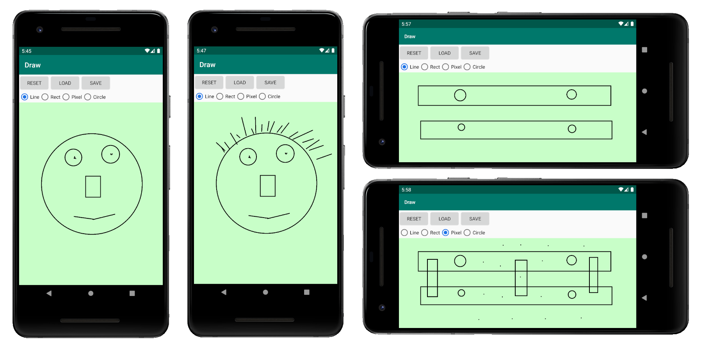

# DrawAndroid

## Overview
DrawAndroid is a simple drawing app built for Android. 

The app provides a canvas for the user to draw in. It is possible to draw shapes such as pixels, lines, circles and squares. Aside from a delete feature, DrawAndroid also allows to save an instance of the current drawing in order to load it later. Full support to portrait and landscape mode is also provided.

## Preview

## Credits
This application was developed for the Object Oriented Programming class (2nd semester) at [ISEL](https://www.isel.pt/).

Developed by:
* [TiagoMMDavid](https://github.com/TiagoMMDavid)
* [PTKickass](https://github.com/PTKickass)
